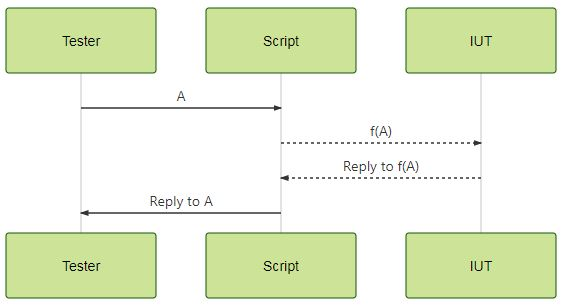
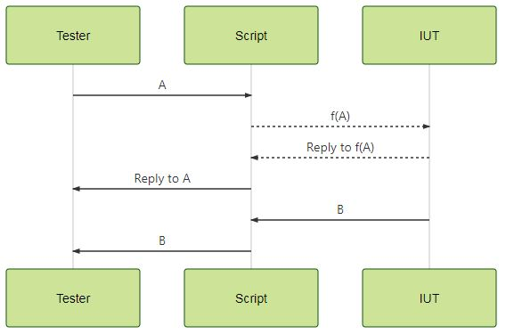

# Demo bridge

This is the demo code developed for the second Python talk, where we mainly have talked about BLE automation.

## Motivation

Sometimes it is necessary to automate things because you do not want to perform bored stuff, you want to skip some
behavior or simply because it is mandatory. In this project, I will try to introduce a BLE device automation using the 
well known HCI protocol from Bluetooth with the following examples:

1. Translate HCI to 2-wires and vice versa, so the tester can interact with the IUT using HCI instead of 2-wires protocol.
2. Hack the event for the HCI Reset command.

Please note that these examples have **ONLY** been developed for teaching purposes. 

## Scenarios

The tester communicates with the IUT using the HCI protocol, but depending on the commands, the IUT may generate events 
from its side. Due to this, two solution have been developed:

- Synchronous: All replies from the BLE device are due to a command invoked by the tester. For this scenario, 
it is not necessary to use threads (although used to introduce the asynchronous solution). 


- Asynchronous: The BLE device can generate an event at any time.


## Requirements

- Python 3.6 or later

## How to use

1. Develop your own IUT implementation for the **BLECommands** or **RFCommands** class.
2. Set up correctly the config.conf file according to your needs.
3. Run the bridge script:\
     ```python bridge.py```